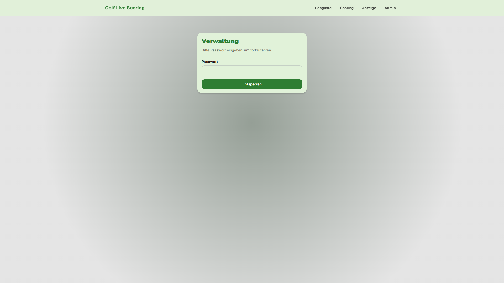
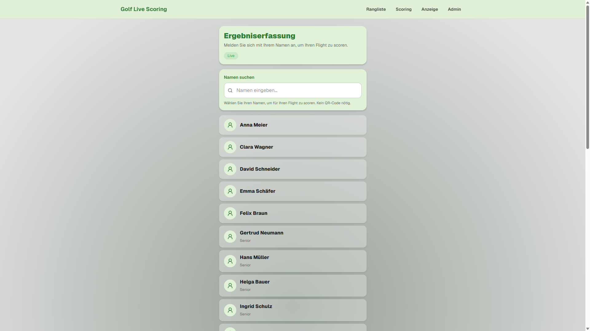
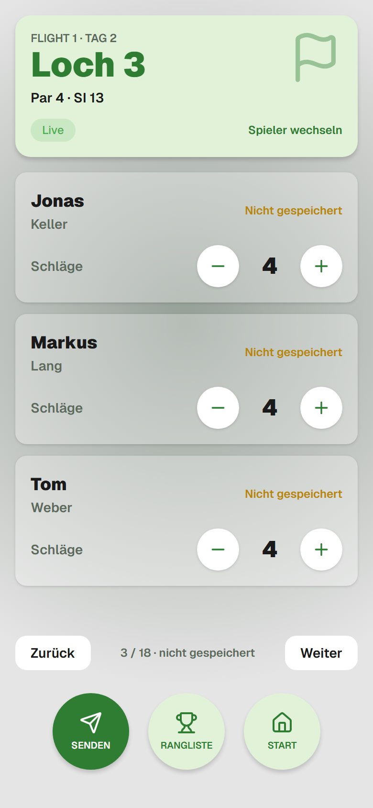
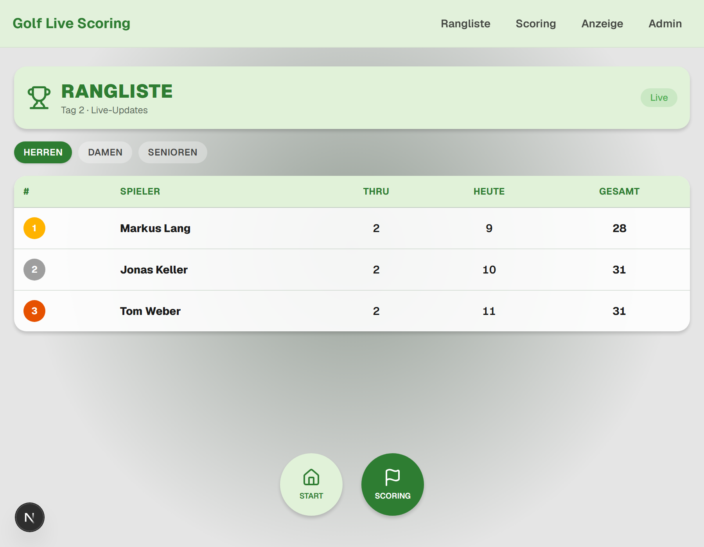
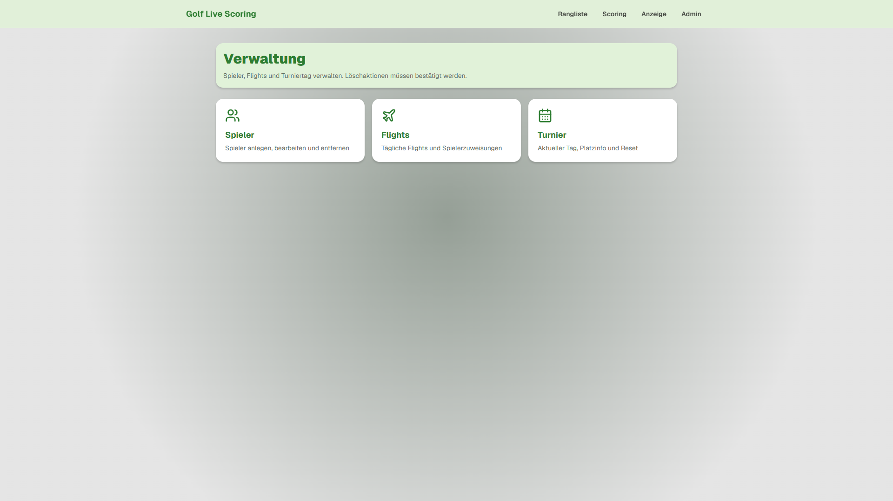
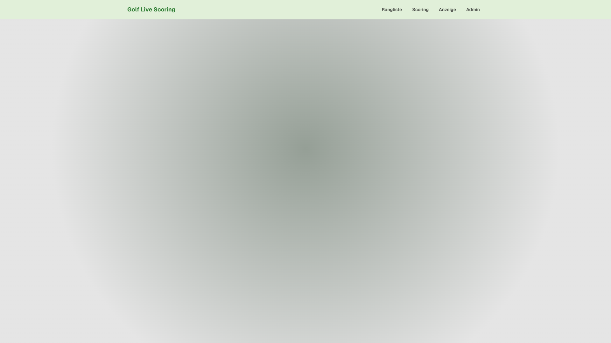
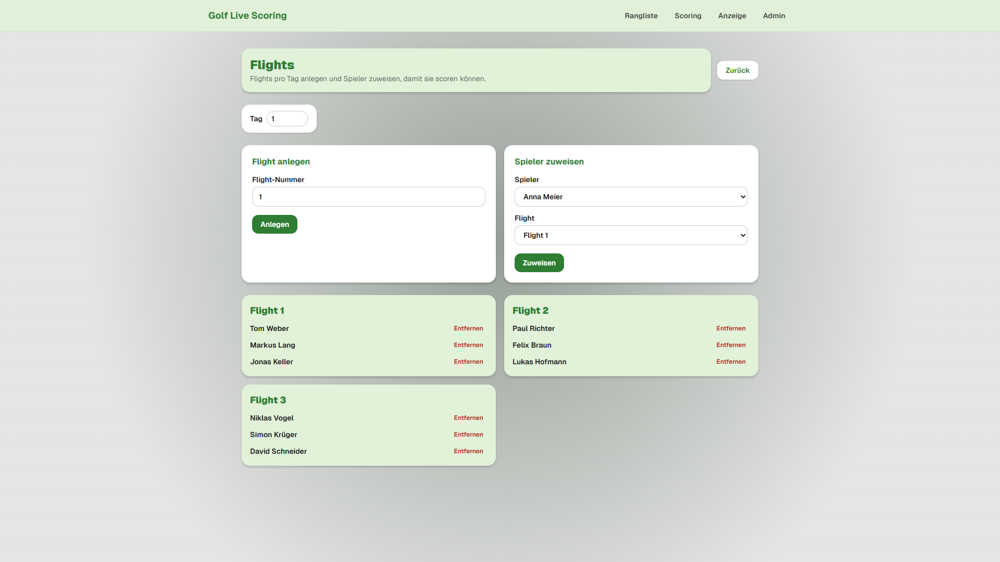

# Anleitung — Golf Live Scoring

Kurzüberblick für **Spieler** und **Admins**.  
Live-App: [www.livescoringkitzingen.de](https://www.livescoringkitzingen.de/)

---

## Für Spieler

### 1. Startseite öffnen

Öffnen Sie die App. Der Status wechselt kurz zu **Verbinden…** und dann zu **Live**.



- **Scoring starten** — Ergebnisse erfassen  
- **Rangliste anzeigen** — aktuelle Platzierungen  
- **Großanzeige** — Clubhaus-/TV-Ansicht  

### 2. Namen wählen und scoren

1. Tippen Sie auf **Scoring starten**.
2. Suchen Sie Ihren Namen (kein QR-Code).
3. Tragen Sie die Schläge für Ihren Flight ein.
4. Tippen Sie **Senden** — danach geht es zum nächsten Loch.
5. Über **Rangliste** können Sie zwischendurch schauen und danach wieder am gleichen Loch weiterscoren.



**Hinweise**

- Nur Spieler mit Flight-Zuweisung für den **aktuellen Turniertag** können scoren.
- Wenn alle 18 Löcher des Flights gespeichert sind, kehren Sie automatisch zur Startseite zurück.
- Fertige Flights können an diesem Tag nicht erneut geöffnet werden.

### 3. Scoring am Loch

Nach der Namenswahl sehen Sie Flight, Tag und Loch, Schläger-Stepper für alle Flight-Partner sowie **Senden**, **Rangliste** und **Start**.



- **Senden** speichert die Schläge für das aktuelle Loch.
- **Zurück** / **Weiter** wechseln das Loch (auch ohne zu speichern — ungespeicherte Werte gehen verloren).
- **Spieler wechseln** bringt Sie zurück zur Namenssuche.

### 4. Rangliste ansehen

Filter **Herren / Damen / Senioren**. Spalten:

| Spalte | Bedeutung |
|--------|-----------|
| Thru | Gespielte Löcher heute (`F` = 18 fertig) |
| Heute | Brutto-Schläge **am aktuellen Tag** |
| Gesamt | Brutto-Schläge **über alle Tage** |



Am ersten Turniertag sind **Heute** und **Gesamt** gleich. Ab Tag 2 weichen sie voneinander ab.

---

## Für Admins

Admin-Zugang: Menü **Admin** / **Verwaltung**. Passwort: `gckitzingen2026` (nur gegen versehentlichen Zugriff).


Nach dem Entsperren:



### Typischer Turnierablauf

#### A) Spieler anlegen

**Verwaltung → Spieler**

- Name, Geschlecht, optional **Senior**
- Senioren erscheinen in der Rangliste **Senioren** (nicht zusätzlich bei Herren/Damen)



#### B) Flights für den Tag

**Verwaltung → Flights**

1. Tag wählen (z. B. 1).
2. Flight-Nummern anlegen (typisch 3 Spieler pro Flight).
3. Spieler zuweisen — zugewiesene Spieler verschwinden aus der Auswahlliste.
4. Falsche Zuweisung? **Entfernen**, dann neu zuweisen.



**Beispiel-Setup (mehrtägig)**

| Tag | Wer spielt | Flights |
|-----|------------|---------|
| 1 | nur Herren | z. B. 3 Flights à 3 |
| 2–3 | Herren + Damen + Senioren | neue Flights pro Tag |

Flights sind **pro Tag** — für Tag 2 und 3 neu anlegen/zuweisen.

#### C) Turniertag wechseln

**Verwaltung → Turnier**

- Aktuellen Tag setzen (1 → 2 → 3)
- Erst danach Flights für den neuen Tag zuweisen und scoren lassen
- **Turnier zurücksetzen** löscht alle Daten in Redis (mit Bestätigung)

#### D) Während des Spiels

- Ranglisten aktualisieren sich live (Herren / Damen / Senioren).
- Großanzeige eignet sich für Monitore im Clubhaus.

---

## Häufige Fragen

**„Player has no flight assignment for the current day.“**  
→ Für den aktuellen Tag noch keinem Flight zugewiesen, oder der Tag wurde gewechselt ohne neue Zuweisung.

**Verbindung „Verbinden…“ bleibt hängen**  
→ Backend startet ggf. nach Pause. Kurz warten und Seite neu laden.

**Admin auf dem Handy?**  
→ Header und Admin-Button sind auf kleinen Bildschirmen ausgeblendet; Admin ist für Desktop gedacht (direkte URL `/admin/` bleibt möglich).

---

## Demo-Daten neu anlegen (Entwickler)

Kurzer Seed für Screenshots / Tests gegen das Live-Backend:

```bash
node scripts/seed-guide.mjs
```

Optional Screenshots:

```bash
npx playwright install chromium
node scripts/capture-guide-screens.mjs
# oder nur Rangliste (lokal): APP_BASE=http://localhost:3000 node scripts/capture-leaderboard-only.mjs
```
